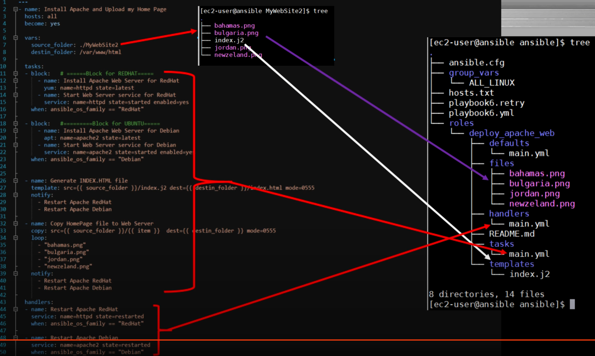

# Part 1 - Introduce

## Ansible directory contains
hosts.txt (or another name) - contains all clients IP and groups;  
ansible.cfg - contains default variables like inventory file name.

## Command examples
\> **ping to remote node**  
```
$ ansible all -m ping  
```
all  - group name  
-m   - module  
ping - name of module

\> **shows options of remote node**  
```
$ ansible prod_servers -m setup
```

## Ad-Hoc commands
```
$ ansible all -m shell -a "uptime"
$ ansible all -m shell -a "ls /etc/ | grep group"
$ ansible all -m shell -a "apt update && apt upgrade -y && apt install mc -y" -b
```
"shell" or "command" see docs  
-a - argument

\> **copy files from host to nodes**
```
$ ansible all -m copy -a "src=test_copy.md dest=/home/oleksandr mode=777" -b 
```
src= - absolute or relative path  
dest= - absolute path
mode= - chmode numerical permissions  
-b - (become) become sudo

\> **delete files from host to nodes**
```
$ ansible all -m file -a "path=/home/test_copy.md state=absent" -b
```

\> **download files to nodes**
```
$ ansible all -m get_url -a "url=https://releases.hashicorp.com/terraform/1.3.1/terraform_1.3.1_linux_amd64.zip dest=/home/oleksandr/"
$ ansible all -m shell -a "ls -la /home/oleksandr"
```

\> **install packages inside nodes** 
```
$ ansible all -m apt -a "name=mc state=latest" -b
for delete >>>
$ ansible all -m apt -a "name=mc state=absent" -b
```

\> **read data from url**
```
$ ansible all -m uri -a "url=https://translate.google.com return_content=yes"
```
return_content= - returns content from site (default "no", only check connection)

\> **install appache**
```
$ ansible all -m apt -a "name=apache2 state=latest" -b
$ ansible all -m service -a "name=apache2 state=started enabled=yes" -b 
$ curl 192.168.1.41
for delete >>>
$ ansible all -m apt -a "name=apache2 state=absent" -b
```
-m service - menages services
state=started - run service
enabled= - startup loading

/> **debugging**.  
Information about ansible and connection details
```
$ ansible all -m shell -a "ls /var" -v (-v to -vvvv more "v" more information)
```
/> **usefull command**
```
$ ansible-doc -l (shows all modules)
$ ansible-doc -l | grep ec2
```

# Part 2 - Playbook
playbook_1.yml
```
---
- name: Test connection to my servers
  hosts: all
  become: yes

  tasks: 
  - name: Ping my servers
    ping:
```
name: - name of playbook  
hosts: - list of hosts to use  
become: - root  
tasks: - list of tasks and name  
ping: - module to run (after ":" we can add attributes if module requires) 

playbook_2.yml
```
---
- name: Install default Apache web server
  hosts: all
  become: yes

  tasks:
  - name: Install Apache web server
    apt: name=apache2 state=latest

  - name: Start Apache and enable it on the every boot
    service: name=apache2 state=started enabled=yes
```
variables example
```
*set value to variables*
  
  vars:
   source_folder: ./web_site
   destination_folder: /var/www/html

*call variables*

- name: Copy site to web servers
    copy: src={{ source_folder }} dest={{ destination_folder }} mode=0555
    notify: Restart Apache 

*set handlers*
    
    handlers:
  - name: Restart Apache
    service: name=apache2 state=restarted
```
notify: - hooks handlers if completed 

# Part 3 - Variables - Debug, Set_fact, Register (playbook_4.yml)
```
---
- name: My Playbook for variables lesson
  hosts: all
  become: yes

  vars:
   message_1: Hello
   message_2: World
   secret   : adjjsjdnawudqudnxc

  tasks:
  - name: Print secret variable
    debug:
     var: secret

  - debug:
     msg: "Password is: {{ secret }}"
```
Module 'debug' is used for showing debug message. When task executed it shows input variable or.   
Module 'debug' takes two arguments: **var:** or **msg:**.  
There is no difference where variables store in **group_vars** or in **hosts.txt**.

Module **set_fact:** is used to connect variables
```
  - set_fact: full_message="{{ message_1 }} {{message_2}} from {{ owner }}"

  - debug:
     var: full_message
```
**Also we can use any variables from other modules. As example "$ansible all -m setup"**  
Use command **register:** allows to save an output.
```
  - shell: uptime
    register: results

  - debug:
     var: results
```
OR
```
  - debug:
     var: results.stdout
```
If we need only one or severals variables from output     


# Part 4 - Blocks and Conditions. Block-When (playbook_5.yml)
If some conditions present, use module **when:**  
Use operators == or !=
```
  - name: Install Apache web servers for Ubuntu
    apt: name=apache2 state=latest
    when: ansible_os_family == "Debian"

  - name: Install Apache web servers for CentOS
    yum: name=httpd state=latest
    when: ansible_os_family == "RedHat"
```
Use blocks to avoid replication of some modules
```
  - block: # Block for Debian family
  
      - name: Install Apache web server
        apt: name=apache2 state=latest
        
      - name: Copy site to web servers
        copy: src={{ source_folder }} dest={{ destination_folder }} mode=0555
        notify: Restart Apache Debian

      - name: Start Apache and enable it on the every boot
        service: name=apache2 state=started enabled=yes
    
    when: ansible_os_family == "Debian"

  - block: # Block for RedHat family

      - name: Install Apache web server
        yum: name=httpd state=latest

      - name: Copy site to web servers
        copy: src={{ source_folder }} dest={{ destination_folder }} mode=0555
        notify: Restart Apache RedHat

      - name: Start Apache and enable it on the every boot for CentOS
        service: name=httpd state=started enabled=yes
        
    when: ansible_os_family == "RedHat"

  handlers:
  - name: Restart Apache Debian
    service: name=apache2 state=restarted

  handlers:
  - name: Restart Apache RedHat
    service: name=httpd state=restarted
```
# Part 5 - Loop-Items (playbooks: playbook_6.yml, playbook_6_loop.yml)
There is several types of loops  
Module ***loop*** or ***with_items***  
```
tasks:
  - name: Say Hello to everyone
    debug: msg="Hello {{ item }}!"
    loop:       # or with_items: 
      - "Oleksandr"
      - "Olha"
      - "User_1"
      - "User_2"
```
Module ***until***
```
  - name: Loop Until for example
    shell: echo -n U >> my_file.txt && cat my_file.txt
    register: output
    delay: 5
    retries: 10       # Default execute 3 times
    until: output.stdout.find("UUUU") == false

  - name: Print final output
    debug:
      var: output.stdout
```
Use module ***loop*** when needs to copy many files or install many packages or something else.  
```
  - name: Install many packages
    apt: name={{ item }} state=latest
    loop:
      - python3
      - mc
      - apache2
      - tree
      - mysql-client
```
Other example 1
```
  - name: Copy site to web servers for (Debian)
    copy: src={{ source_folder }}/{{ item }}       dest={{ destination_folder }} mode=0555
    loop:
      - "index.html"
      - "error.html"
      - "styles.css"
      - "/images/profile_photo.png"
```
Other example 2 with using module ***with_fileglob:***
```
  - name: Copy site to web servers for (Debian)
    copy: src={{ item }}       dest={{ destination_folder }} mode=0555
    with_fileglob: "{{ source_folder }}/*.*"
```

# Part 6 - Jinja Template (playbook_7.yml)
For generate html page or something else use Jinja (*.j2) file.  
You can use variables ***{{ }}***. 
```
            <div class="col-lg-6">
                <h1 class="display-5 fw-bold lh-1 mb-3">Owner of this server is: {{ owner }} </h1>
                <p class="display-5">Generated by Ansible</p>
                <p class="display-5">Server host name: {{ ansible_hostname }}</p>
                <p class="display-5">Server OS Family is: {{ ansible_os_family }}</p>
                <p class="display-5">IP address of this server is: {{ ansible_default_ipv4.address }}</p>
            </div>
```
Example of call module ***template:***
```
  - name: Generate INDEX.HTML file
    template: src={{ source_folder }}/index.j2  dest={{ destination_folder }}/index.html mode=0555
    notify:
      - Restart Apache Debian
      - Restart Apache RedHat
```
# Part 7 - Roles (playbook_8.yml and role: /roles/deploy_apache_web)
***Ansible roles*** is a set of tasks to configure a host to serve a certain purpose like configuring a service

Create directory with constant name ***roles***.  
For initialize role move to directory /roles and use command:
```
$ ansible-galaxy init name_of_role
```
It creates folder and structure for this role. Below is small explanation from ansible web site.
```
roles/
    common/               # this hierarchy represents a "role"
        tasks/            #
            main.yml      #  <-- tasks file can include smaller files if warranted
        handlers/         #
            main.yml      #  <-- handlers file
        templates/        #  <-- files for use with the template resource
            ntp.conf.j2   #  <------- templates end in .j2
        files/            #
            bar.txt       #  <-- files for use with the copy resource
            foo.sh        #  <-- script files for use with the script resource
        vars/             #
            main.yml      #  <-- variables associated with this role
        defaults/         #
            main.yml      #  <-- default lower priority variables for this role
        meta/             #
            main.yml      #  <-- role dependencies
        library/          # roles can also include custom modules
        module_utils/     # roles can also include custom module_utils
        lookup_plugins/   # or other types of plugins, like lookup in this case

    webtier/              # same kind of structure as "common" was above, done for the webtier role
    monitoring/           # ""
    fooapp/               # ""
```
***defaults*** - variables that will be overridden (these are, in fact, role parameters), for example - the version of Apache to install.  
***vars*** - variables that are not planned to be redefined. For example, the package name to install.  
Roles are listed in playbook



# Part 8 - Extra-vars (playbook_9)
If we use some variables in playbook but didn't define it in any file we can transfer it as an extra-vars when execute command.  
Use parameters:  
***-e***  
***-- extra-var***  
***-- extra-vars***  
Example:  
```
ansible-playbook playbook_9.yml -e "my_hosts=test_servers"
```
If variable exist in some file but in extra-vars uses another value of variable, will be used value from extra-vars.
```
ansible-playbook playbook_9.yml -e "my_hosts=test_servers owner='New owner'"
ansible-playbook playbook_9.yml -extra-vars "my_hosts=test_servers owner=\"New owner\""
```

# Part 9 - Import, Include (playbook_10_includes.yml, create_files.yml, create_folders.yml)
Ansible has two modes of operation for reusable content with Including and Importing and Roles: dynamic and static. The main difference is:   
All import* statements are pre-processed at the time playbooks are parsed.  
All include* statements are processed as they encountered during the execution of the playbook.
```
  vars:
    my_text: "Hello World!"
  
  tasks:
  - name: Ping test
    ping:

  - name: Create folders
    include: create_folders.yml

  - name: Create files
    include: create_files.yml
OR
 tasks:
  - name: Ping test
    ping:

  - include: create_folders.yml
  - include: create_files.yml my_text="Hello from Oleksandr!"
```
# Part 10 - delegate_to (playbook_11_delegate.yml)
This part shows how to delegate tasks to a different machine or group, delegate facts to specific machines or groups, or run an entire playbook locally. Using these approaches, you can manage inter-related environments precisely and efficiently. For example, when updating your webservers, you might need to remove them from a load-balanced pool temporarily. You cannot perform this task on the webservers themselves. By delegating the task to localhost, you keep all the tasks within the same play.  

To delegate some task needs add module ***delegate_to:*** to task.
```
  tasks:
  - name: Ping test
    ping:

  - name: Create file_1
    copy:
      dest: /home/secret/file_1.txt
      content: |
        Text Line_1, in file_1
        Text Line_2, in file_1
        Text Line_3, {{ my_text }}
    delegate_to: ansible_1
```
```
  - name: Unregister Server from Load Balancer
    shell: "echo This server {{ inventory_hostname }} was 
            unregistered from our Load Balancer, 
            node name is {{ ansible_nodename }} >> /home/log.txt"
    delegate_to: 127.0.0.1
```
If needs to restart servers, will use next module:
```
  - name: Reboot my servers
    shell: sleep 3 && reboot now
    async: 1
    poll: 0
```
***async:*** By default Ansible runs tasks synchronously, holding the connection to the remote node open until the action is completed. This means within a playbook, each task blocks the next task by default, meaning subsequent tasks will not run until the current task completes.  
***poll:*** If you want to run multiple tasks in a playbook concurrently, use async with poll set to 0. When you set poll: 0, Ansible starts the task and immediately moves on to the next task without waiting for a result. Each async task runs until it either completes, fails or times out (runs longer than its async value). The playbook run ends without checking back on async tasks.  

If we need to wait when servers will be restarted, will use next module:
```
  - name: Wait until servers get started
    wait_for:
      host: "{{ inventory_hostname }}"
      state: started
      delay: 5
      timeout: 60
    delegate_to: 127.0.0.1
```


# Remarks
If you use CentOS or something with python 2, will use next tips:
Install python 3 and libselinux-python3
```
$ sudo yum install python3
$ sudo yum install libselinux-python3
```
Also use next variable in **group_vars**
```
ansible_python_interpreter   : /usr/bin/python3
```